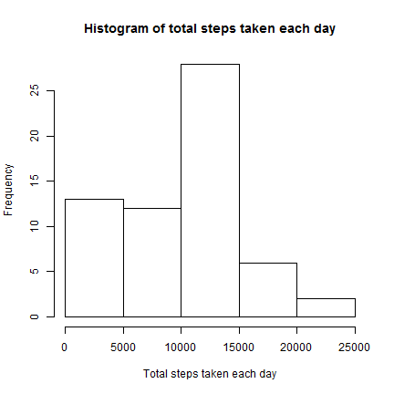
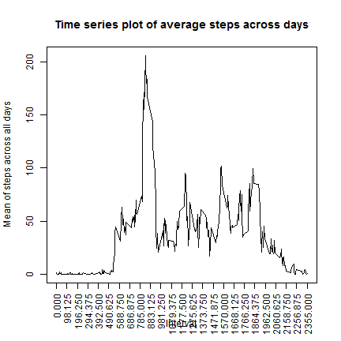
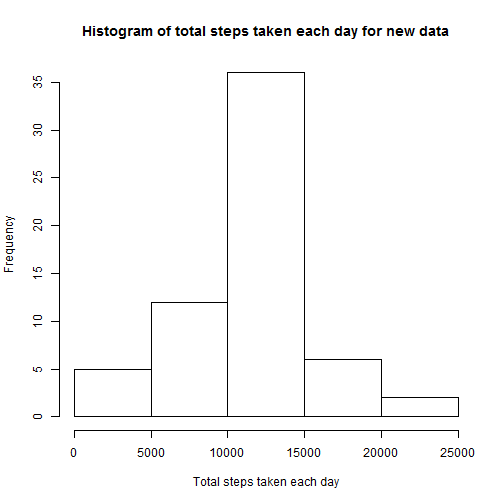
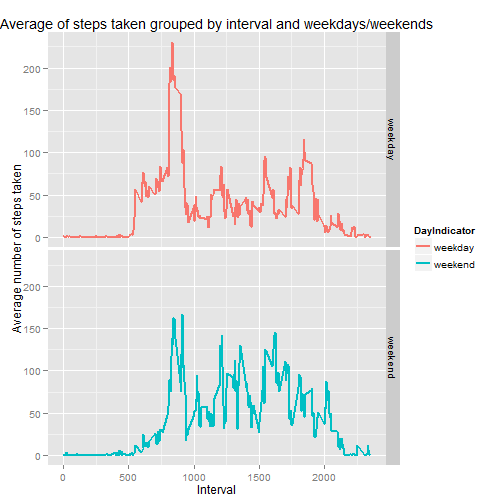

## Loading and preprocessing the data
Let us first read the data file into an R data frame and convert date to Date type variable.

```r
data = read.csv("activity.csv",header=TRUE,na.strings="NA")
data$date = as.Date(as.character(data$date),"%d-%m-%Y")
```


## What is mean total number of steps taken per day?
We will find sum of steps taken grouped by day using aggregate() function. We remove observations which have missing value in steps variable.

```r
sumofsteps = aggregate(data$steps,by=list(Date = data$date),FUN=sum,na.rm=TRUE)
```
Below is the histogram for total number of steps taken each day.

```r
hist(sumofsteps$x,xlab="Total steps taken each day",main="Histogram of total steps taken each day")
```

 
We now calculate the mean and median of total number of steps taken per day.

```r
mean = mean(sumofsteps$x)
median = median(sumofsteps$x)
```
The mean of total steps taken per day is 9354.2295082.
The median of total steps taken per day is 10395.


## What is the average daily activity pattern?
To find the average number of steps taken across all days within each interval, we will use agregate() function.

```r
meanofsteps = aggregate(data$steps,by=list(Interval = data$interval),FUN=mean,na.rm=TRUE)
```

```r
with(meanofsteps,plot(Interval,x,type="l",xaxt="n",ylab="Mean of steps across all days",main="Time series plot of average steps across days"))
axis(1, xaxp=c(0, 2355,24), las=2)
```

 

```r
maxsteps = meanofsteps[meanofsteps$x==max(meanofsteps$x),]
```
The 5-minute interval, on average across all the days in the dataset, that contains the maximum number of steps is 835.


## Imputing missing values
###Number of missing values
We calculate total number of missing values by subsetting using the is.na() function:

```r
m = nrow(data[is.na(data$steps),])
```
The total number of missing values is 2304.

###Create new dataset with NAs filled in with mean of that interval

```r
newdata = data

impute = function(x){    
    mean(newdata[newdata$interval == x,c("steps")],na.rm=TRUE)    
}

for(i in 1:nrow(newdata)){
    if(is.na(newdata[i,c("steps")])){
        newdata[i,c("steps")] = impute(newdata[i,c("interval")])
    }
}
```
We now plot the histogram for total steps taken per day for the new data set.

```r
newsumofsteps = aggregate(newdata$steps,by=list(Date = newdata$date),FUN=sum,na.rm=TRUE)
hist(newsumofsteps$x,xlab="Total steps taken each day",main="Histogram of total steps taken each day for new data")
```

 

Below is the calculation for mean and median of the total steps taken per day for the new data set.

```r
mean1 = mean(newsumofsteps$x)
median1 = median(newsumofsteps$x)
```
The mean of total steps taken per day is 1.0766189 &times; 10<sup>4</sup>.

The median of total steps taken per day is 1.0766189 &times; 10<sup>4</sup>.

As can be seen from above data, imputing the missing values has reduced the frequency in the lowest range of steps and increased the concentration of values around mean (closer to normal curve)

## Are there differences in activity patterns between weekdays and weekends?
To find differences in activity patterns between weekdays and wekends, we create a new factor variable 'wk'.We then find the average steps taken, grouped by this factor variable and interval.

```r
newdata$wk = ifelse(weekdays(newdata$date) %in% c("Saturday","Sunday"),"weekend","weekday" )
wdmeanofsteps = aggregate(newdata$steps,by=list(DayIndicator = newdata$wk,Interval = newdata$interval),FUN=mean,na.rm=TRUE)
```

```r
library("ggplot2")
g = ggplot(wdmeanofsteps,aes(Interval,x))
g + geom_line(size =1) + facet_grid(DayIndicator~.) + aes(color = DayIndicator)  + labs(title="Average of steps taken grouped by interval and weekdays/weekends") + labs(x="Interval") + labs(y="Average number of steps taken") 
```

 


